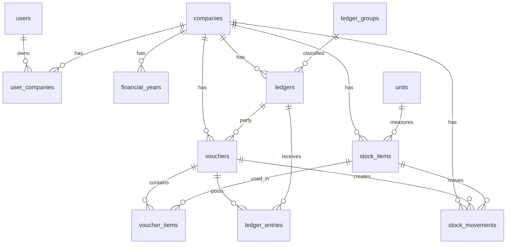

# SmartERP Day 1 - Database Design

## 1. Design Goals

The database must support multi-company accounting, party ledgers, stock items, sales vouchers, purchase vouchers, GST calculations, and stock movement. Every business table is scoped by `company_id` so that one user can manage multiple companies without mixing data.

Voucher save should be handled inside a database transaction:

1. Insert voucher header.
2. Insert voucher line items.
3. Insert ledger entries.
4. Insert stock movements.
5. Update stock balances if using a cached balance table.

## 2. Entity Relationship Overview

## 3. Core Tables

### users

Stores application users.

Important columns:

- `id`
- `name`
- `email`
- `password_hash`
- `created_at`
- `updated_at`

### companies

Stores company profiles.

Important columns:

- `id`
- `name`
- `gstin`
- `address_line1`
- `address_line2`
- `city`
- `state`
- `pincode`
- `phone`
- `email`
- `base_currency`
- `allow_negative_stock`

### user_companies

Maps users to companies and roles. This allows shared access later.

Important columns:

- `user_id`
- `company_id`
- `role`

Roles:

- `owner`
- `admin`
- `accountant`
- `viewer`

### financial_years

Stores company financial years.

Important columns:

- `id`
- `company_id`
- `name`
- `start_date`
- `end_date`
- `is_active`

### ledger_groups

Classifies ledgers for accounting reports.

Recommended system groups:

- Sundry Debtors
- Sundry Creditors
- Sales Accounts
- Purchase Accounts
- Duties and Taxes
- Cash-in-Hand
- Bank Accounts

### ledgers

Stores customers, suppliers, and accounting ledgers.

Important columns:

- `id`
- `company_id`
- `group_id`
- `ledger_type`
- `name`
- `code`
- `gstin`
- `phone`
- `email`
- `billing_address`
- `state`
- `opening_balance`
- `opening_balance_type`
- `credit_limit`
- `credit_days`

Ledger types:

- `customer`
- `supplier`
- `cash`
- `bank`
- `sales`
- `purchase`
- `tax`
- `other`

### units

Stores item units.

Examples:

- Nos
- Kg
- Litre
- Box
- Pack

### stock_items

Stores inventory items.

Important columns:

- `id`
- `company_id`
- `unit_id`
- `name`
- `sku`
- `hsn_sac`
- `gst_rate`
- `opening_quantity`
- `opening_value`
- `selling_price`
- `purchase_price`
- `reorder_level`
- `is_active`

### vouchers

Stores voucher header data.

Important columns:

- `id`
- `company_id`
- `financial_year_id`
- `voucher_type`
- `voucher_number`
- `voucher_date`
- `party_ledger_id`
- `supplier_invoice_number`
- `supplier_invoice_date`
- `taxable_amount`
- `cgst_amount`
- `sgst_amount`
- `igst_amount`
- `discount_amount`
- `round_off_amount`
- `grand_total`
- `status`

Voucher types:

- `sales`
- `purchase`

Statuses:

- `draft`
- `posted`
- `cancelled`

### voucher_items

Stores voucher line items.

Important columns:

- `id`
- `voucher_id`
- `stock_item_id`
- `description`
- `quantity`
- `unit_price`
- `discount_percent`
- `discount_amount`
- `taxable_amount`
- `gst_rate`
- `cgst_amount`
- `sgst_amount`
- `igst_amount`
- `line_total`

### ledger_entries

Stores accounting postings generated from vouchers.

For a sales voucher:

- Customer ledger is debited.
- Sales ledger is credited.
- GST ledger is credited.

For a purchase voucher:

- Purchase ledger is debited.
- GST ledger is debited.
- Supplier ledger is credited.

Important columns:

- `id`
- `company_id`
- `voucher_id`
- `ledger_id`
- `entry_date`
- `debit_amount`
- `credit_amount`
- `narration`

### stock_movements

Stores inventory movements generated from vouchers.

For sales:

- Quantity moves out.

For purchases:

- Quantity moves in.

Important columns:

- `id`
- `company_id`
- `voucher_id`
- `voucher_item_id`
- `stock_item_id`
- `movement_date`
- `movement_type`
- `quantity`
- `unit_cost`
- `total_value`

Movement types:

- `opening`
- `purchase_in`
- `sales_out`
- `adjustment_in`
- `adjustment_out`

## 4. Key Constraints

- One user can own or access many companies.
- One company can have many users.
- One user should not create more than five owned companies at application level.
- Ledger names must be unique per company.
- Stock item names should be unique per company.
- SKU should be unique per company when provided.
- Voucher numbers must be unique per company, financial year, and voucher type.
- Voucher line quantities must be greater than zero.
- GST rate must be between 0 and 100.
- Voucher totals should use decimal precision, not floating point.

## 5. Indexing Plan

Recommended indexes:

- `companies(name)`
- `user_companies(user_id, company_id)`
- `ledgers(company_id, ledger_type)`
- `ledgers(company_id, name)`
- `ledgers(company_id, gstin)`
- `stock_items(company_id, name)`
- `stock_items(company_id, sku)`
- `vouchers(company_id, voucher_type, voucher_date)`
- `vouchers(company_id, financial_year_id, voucher_type, voucher_number)`
- `ledger_entries(company_id, ledger_id, entry_date)`
- `stock_movements(company_id, stock_item_id, movement_date)`

## 6. Reporting Queries Supported

### Customer Ledger

Use `ledger_entries` filtered by:

- `company_id`
- `ledger_id`
- `entry_date`

### Supplier Ledger

Use the same `ledger_entries` table with supplier ledger IDs.

### Stock Summary

Use `stock_movements` grouped by item:

- Opening quantity
- Purchase inward quantity
- Sales outward quantity
- Closing quantity
- Closing value

### Sales Register

Use `vouchers` filtered by:

- `voucher_type = 'sales'`
- date range
- company

### Purchase Register

Use `vouchers` filtered by:

- `voucher_type = 'purchase'`
- date range
- company

## 7. Accounting Posting Rules

### Sales Voucher

Example customer bill for `1180`, including `180` GST:

| Ledger | Debit | Credit |
| --- | ---: | ---: |
| Customer | 1180 | 0 |
| Sales | 0 | 1000 |
| GST Output | 0 | 180 |

### Purchase Voucher

Example supplier purchase for `1180`, including `180` GST:

| Ledger | Debit | Credit |
| --- | ---: | ---: |
| Purchase | 1000 | 0 |
| GST Input | 180 | 0 |
| Supplier | 0 | 1180 |

## 8. Stock Posting Rules

### Sales

- Create `sales_out` movement.
- Quantity is stored as positive in `stock_movements`.
- Closing stock calculation subtracts sales movements.

### Purchase

- Create `purchase_in` movement.
- Quantity is stored as positive in `stock_movements`.
- Closing stock calculation adds purchase movements.

## 9. Recommended Build Order

1. Authentication and company setup
2. Ledger groups and default ledgers
3. Customer and supplier ledgers
4. Units and stock items
5. Sales voucher
6. Purchase voucher
7. Ledger entries
8. Stock movements
9. Reports
10. PDF invoice

